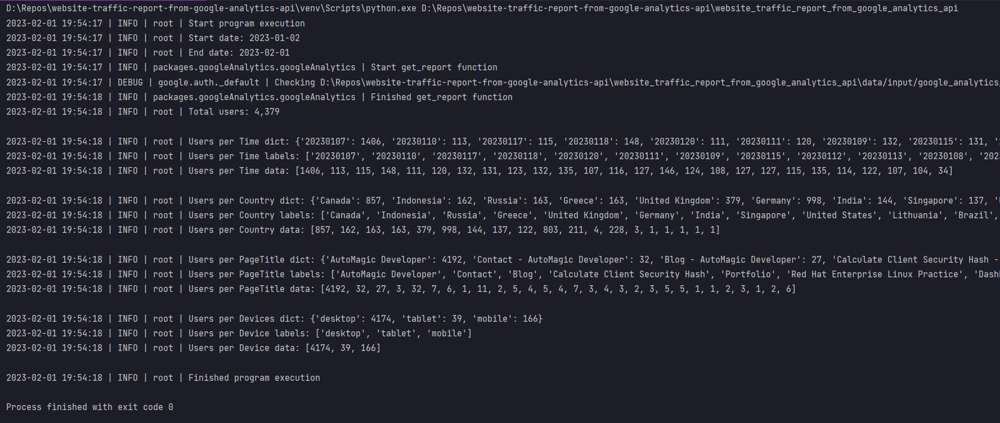

[![LinkedIn][linkedin-shield]][linkedin-url]

<!-- PROJECT LOGO -->
 

    
  <h3 align="center">Google Analytics Traffic Report Automation</h3>

<!-- TABLE OF CONTENTS -->

  
Table of Contents

  <ol>
    <li>
      <a href="#about-the-project">About The Project</a>
      <ul>
        <li><a href="#business-case">Business Case</a></li>
        <li><a href="#technical-solution">Technical Solution</a></li>
        <li><a href="#screenshots">Screenshots</a></li>
        <li><a href="#tech-stack">Tech Stack</a></li>
      </ul>
    </li>
    <li><a href="#contact">Contact</a></li>
  </ol>

<!-- ABOUT THE PROJECT -->
## About The Project

![cover]

* **Project Name:** Google Analytics Traffic Report Automation  
* **Version:** v1.0.0  
* **Organization Department:** Technology

---

### Business Case

Managing and visualizing website traffic from multiple platforms can be cumbersome. My goal was to develop a customized solution for my website, automagicdeveloper.com, that consolidates Google Analytics traffic data into a single admin panel, eliminating the need to manage traffic reports from multiple sources.

I wanted to gather key traffic metrics directly from Google Analytics without logging into separate platforms, simplifying the workflow and providing easy access to insights.

(<a href="#readme-top">back to top</a>)

### Technical Solution

I developed an automation system to interact with the Google Analytics API and gather website traffic statistics efficiently. The project was designed to retrieve all necessary metrics in one API call, analyze the data, and prepare it for visualization within my admin panel.

**Key Features:**
* **Authentication with Google Analytics API:** Securely connected to Google Analytics to fetch real-time data.
* **Data Retrieval:** Pulled data for the last 30 days, including:
  * Total user count
  * Users count per date
  * Users count per country
  * Users count per device
  * Users count per page title
* **Performance:** The entire process, from API call to data preparation, takes only two seconds.
* **Data Visualization:** Prepared the data for visualization using JavaScript in the admin panel.

(<a href="#readme-top">back to top</a>)

### Screenshots

(<a href="#readme-top">back to top</a>)

### Tech Stack

This project was developed using the following tech stack:

* **Python**
* **Google Analytics API**

(<a href="#readme-top">back to top</a>)

<!-- CONTACT -->
## Contact

Mohamed AbdelGawad Ibrahim - [@m-abdelgawad](https://www.linkedin.com/in/m-abdelgawad/) - <a href="tel:+201069052620">+201069052620</a>

(<a href="#readme-top">back to top</a>)

<!-- MARKDOWN LINKS & IMAGES -->
[linkedin-shield]: https://img.shields.io/badge/-LinkedIn-black.svg?style=for-the-badge&logo=linkedin&colorB=555
[linkedin-url]: https://www.linkedin.com/in/m-abdelgawad/
[cover]: images/cover.jpg
